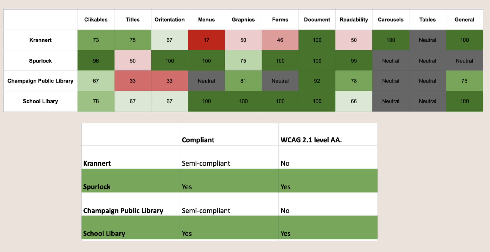

# Final blog

- Starting from choosing the topics, what are digital humanities, or what are digital humanities that are around us is always something on my mind. Separating the words into digital and humanities, it is not too hard to understand the computation and humanity side of this interdisciplinary study. According to Simon Appleford, DH(short for Digital Humanities) is ‘The use of digital tools, technologies, and techniques to explore, analyze, and understand the humanities’. Similar to Simon, Georg Vogeler states that ‘Making use of the Information Technologies for Humanities research’ is also considered DH. Before I first met with Professor Zoe for the project selection, I kind of restricted myself in the way of coding. But how do people with limited technical skills research DH? Are there end-user tools that help with digital humanities? And of course, what are some topics in the humanities field? While thinking about previous experiences, I thought about an internship I did last summer in the web development industry that has a quality assurance component of ADA assessment. It used several tools and an ADA team to assure the accessibility of the websites. With the background study of universal design and information accessibility as well as my passion for equal access for minority groups, I affirm my selection on this topic.
- During the process of developing our project, I especially pay attention to the data biography mentioned by Krause, H. (2017, March 27) about where, who, how, and why collect those data. We chose four websites of small institutions near us– Spurlock Museum, Krannert Museum, Champaign Public Library, and University library. It would not be surprising for a big company with a high budget in web development to have compliant websites, but what about these small institutions?  In our project, Yingyu and Cathy are the ones that collect the data from those websites. By using web assessing tools (assessibe, Siteimprove) and archive tools (internet archive), we collect the data on the compliance of web accessibility and the history of websites from those tools. We hope to use the gathering and assessing of compliance data to not only help us understand the web accessibility around us but also to potentially help advocate the topic of accessibility to people in our community. We also want to collect the data from the archive of the websites to understand how the websites were and how did it iterate over time.
- During the process of developing this project, there are things we added or changed since the initial selection. First, We added the tool Siteimprove to our methods to make sure the accuracy of our assessment. It was not first designed in our project, but as we learned more about research and the importance of data accuracy, this is an important step we added to our final project. Though the results from both tools present the same finding, it affirms its credibility. The second change we made is to add the internet archive to our project. Though it is vital to understand the current situation, it is also important to get a sense of where this site came from. Originally we wanted to assess the accessibility of the previous version of these sites, but later we found out it was not achievable. But we do see many changes over the years. Throughout our project, we found out our small institution is paying attention to accessibility in websites. It is surprising to me that even websites (probably with a low budget for development) in our community. Although there still are some places that need to improve, we are at a positive stage.
- This is our final [project](https://docs.google.com/presentation/d/1mE48Q-BETsKJWYIWK5S-gg2JsSemgEmD6CEuqSaWhb4/edit?usp=sharing). In our final representation of the dataset, we choose to use excel for a timely fashion. I follow the data organization guidelines by Karl W. Broman and Kara H. Woo(2018) for consistency and other tips. In the future, we hope to enlarge the data selection. It might be hard to do it by us, manually find all the small institutions, and manually type all the URLs. If I would have the ability to do fancier coding. I might consider web scraping websites for small institutions based on regions, and generate a data visualization based on the geography of the web accessibility scores. Similar to the visualization from [“The Shape of Slavery” by Bill Rankin and Matt Daniels The Pudding](https://pudding.cool/2017/01/shape-of-slavery/) The interaction of these visualizations also makes the data more powerful and intuitive when watched.
- In one of my projects from another class this semester, I also choose the topic of accessibility. [project link here](https://sites.google.com/illinois.edu/info4everybody/home). I developed this simple site from the Google Site and I was impressed that even this very end-user web development has the component of adding alt text to images and icons. In my personal experience of using Canvas, it also shows its care for information accessibility – that there are tips when adding a list of images. Though these are not some required actions that people have to take, I am still gratified that people are caring about information accessibility online more than ever before. 

# Reference
- What is computing in the humanities? https://whatisdigitalhumanities.com/ 
- Krause, H. (2017, March 27). Data Biographies: Getting to Know Your Data. Global Investigative Journalism Network. https://gijn.org/2017/03/27/data-biographies-getting-to-know-your-data/
- “The Shape of Slavery” Bill Rankin and Matt Daniels The Pudding https://pudding.cool/2017/01/shape-of-slavery/
- Karl W. Broman and Kara H. Woo, “Data Organization in Spreadsheets,” American Statistician 72, no. 1 (2018): 2–10, https://doi.org/10.1080/00031305.2017.1375989

