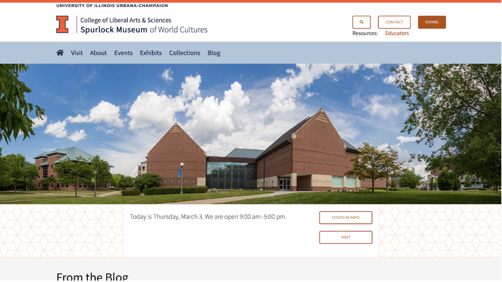
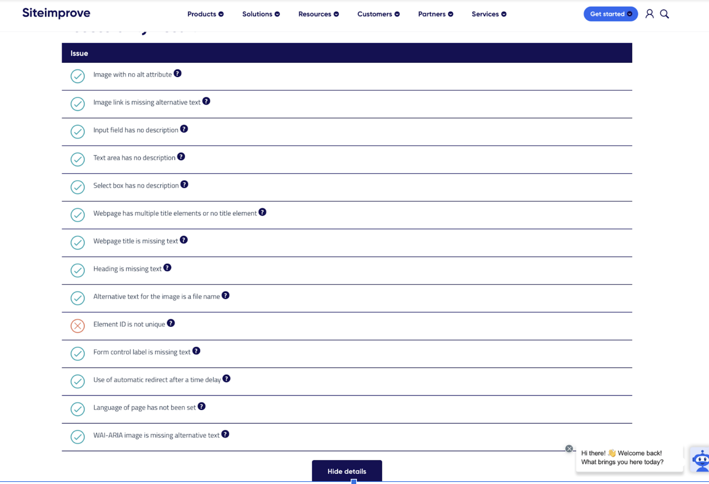
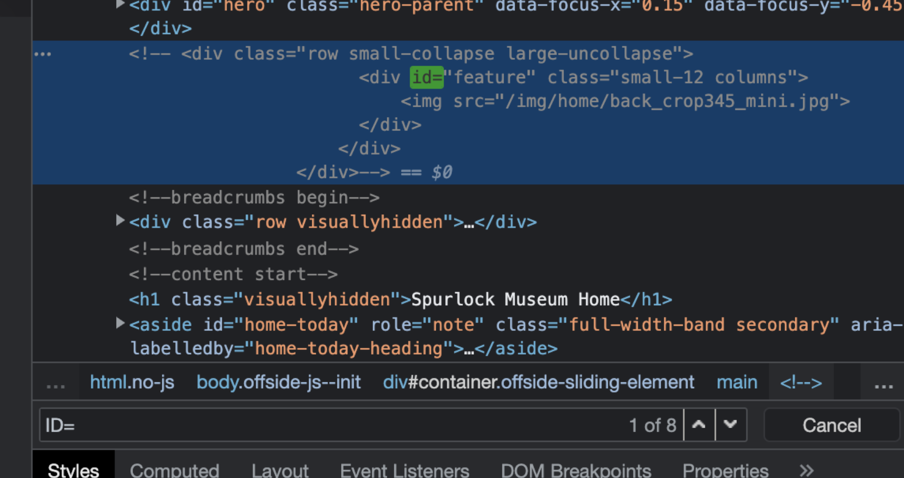
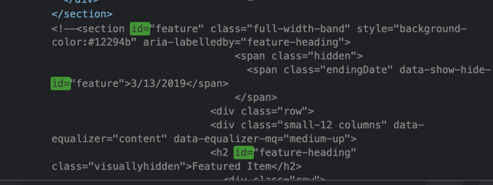

# IS310 Final Project
Yingyu Chen & Cathy Zhang

# Mar 8 Project Proposal

## Project description:
- Our initial project goal is to focus on accessibility design for disability in websites for local library and museum. My group will discover how digital humanity for minority groups is being developed in websites of small institution. Our method of performing this project is to study some of the website ADA laws and assess how the current situation is with disability groups in our local area. Some of the example assessment would be color contrast and alt text for image and tables, etc. I aim to assess, make spreadsheets and analyze 4 - 5 websites. The reason why we are choosing this topic is because we are very interested in disability design, as how minority group would perceive information on the internet. Secondly, we have also seen many articles and videos about disability design in various media online. (There is even a popular TV series in Japan that teaches people about the daily lives of people with disabilities.) This has generated a lot of interest in us and we are very curious about whether there is a deviation between the TV series and the real situation. We hope that the data can reflect the most real situation, and can make more people pay attention to this group of people.

## Outlines:
1. Find the relevant institution and websites.
    https://www.spurlock.illinois.edu
    https://kam.illinois.edu/krannert-art-museum 
    https://champaign.org
    https://www.library.illinois.edu 
2. Learn about ADA policy.
    https://www.qatouch.com/blog/complete-checklist-for-ada-compliance/
3. Check the websites by hand to have the first hand experience
   
4. Use tools like Siteiprove to help with quality assurance
   https://siteimprove.com/en-us/accessibility/result/?website=https://www.spurlock.illinois.edu&email=chenyingyu0505@outlook.com 
    
5. Check the issues again by hand
    
    
    In this case, it is actually the comment area where the id elements has the same name. So nothing more to worry about.

6. Make the data into a table containing checklist and summary for each website.
7. Analysis the whole spreadsheet and produce rationale

## Scholarly Related:
- Our scholarly goal are infering from the data whether the local community is giving enough attention to people with disabilities. And figure out whether there is any relationships between the number of accessible designs and local’s concerns on people with disabilities.

- We perform some analysis and speculation by scraping information from local institutions and websites. We relate the website data to the humanistic issue of the community's attention to people with disabilities. We do not make a list of community initiatives, but rather create a function between the numbers and the level of concern. We express the relationship between accessibility design and social concern.

- Our audience is people who care about minority issues and have some understanding of digital humanities.

- https://en.wikipedia.org/wiki/Universal_design 
    
- https://ifdesign.com/en/if-design-talent-award#Text_Wrapper_Categories1 
